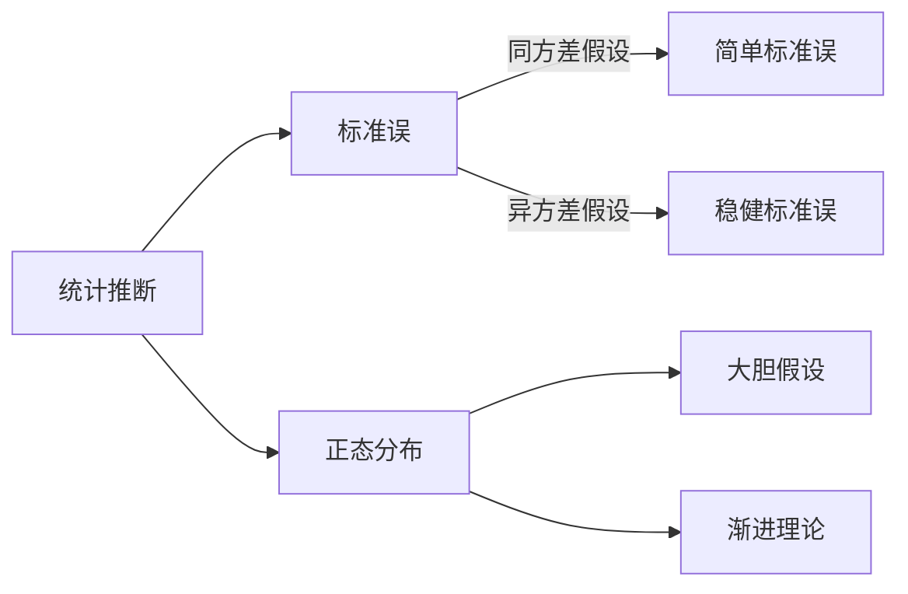

---
{"dg-publish":true,"permalink":"/计量经济学/最小平方估计量的性质/","tags":["线性模型"]}
---

[[计量经济学/Linear Regression Model#模型设定\|Linear Regression Model#模型设定]]如下
$$
\begin{gather*}
\begin{cases}
Y=X^{\mathsf{T}}{\beta}+e\\
E(e|X)=0
\end{cases} \tag{1} \\
\begin{cases}
E(Y^2)<\infty \\
E(\Vert X \Vert^2)<\infty \\
E(XX^{\mathsf{T}})\succ O
\end{cases} \tag{2}
\end{gather*}
$$
[[计量经济学/最小平方估计量#矩阵形式的情形\|最小平方估计量#矩阵形式的情形]] 为
$$
\hat{{\beta}}\equiv\left(\mathbf{X}^{\mathsf{T}}\mathbf{X} \right)^{-1}\left(\mathbf{X}^{\mathsf{T}}\mathbf{Y} \right)
$$
以下结论均假设样本是独立同分布的。

## 条件期望

样本模型和总体模型一致
$$
Y_{i}=X_{i}^{\mathsf{T}}\beta+e_{i}
$$
取条件期望可得
$$
E[Y_{i}\mid \mathbf{X}]=X_{i}^{\mathsf{T}}\beta+E[e_{i}|\mathbf{X}]
$$
从而有
$$
E[\mathbf{Y}\mid \mathbf{X}]=
\begin{bmatrix}
\vdots \\
E[Y_i\mid \mathbf{X}] \\
\vdots \\
\end{bmatrix}
=
\begin{bmatrix}
\vdots \\
X_i^{\mathsf{T}}{\beta}+E[e|\mathbf{X}] \\
\vdots \\
\end{bmatrix}
=\mathbf{X}{\beta}+E[\mathbf{e}\mid \mathbf{X}]
$$
最小平方估计量的条件期望为
$$
\begin{align}
E[\hat{{\beta}}\mid \mathbf{X}]
&=E\left[(\mathbf{X}^{\mathsf{T}}\mathbf{X})^{-1} (\mathbf{X}^{\mathsf{T}}\mathbf{Y})\mid \mathbf{X} \right] \\
&=(\mathbf{X}^{\mathsf{T}}\mathbf{X})^{-1}\mathbf{X}^{\mathsf{T}}E\left[\mathbf{Y}\mid \mathbf{X} \right] \\
&=(\mathbf{X}^{\mathsf{T}}\mathbf{X})^{-1}\mathbf{X}^{\mathsf{T}}(\mathbf{X}{\beta}+E[\mathbf{e}\mid \mathbf{X}]) \\
\end{align}
$$
当且仅当 $E(e|X)=0$ 时（使用[[计量经济学/线性CEF模型\|线性CEF模型]]的假设）
$$
E[\hat{{\beta}}\mid \mathbf{X}]=\beta
$$
我们称这种性质为**无偏性**（unbiasness）。

If $(X,e)$ have a joint normal distribution[^1]，根据期望迭代法则有
$$
E({\beta})=E[E[\hat{{\beta}}\mid \mathbf{X}]\mid X]=E[{\beta}\mid \mathbf{X}]={\beta}
$$
[^1]: 这是一个充分不必要条件；如果 $X$ 服从离散型分布，$\hat{{\beta}}$ 的期望和方差可能不存在。

## 条件方差

最小平方估计量的条件方差为
$$
\begin{align}
Var[\hat{{\beta}}\mid \mathbf{X}]
&=Var[(\mathbf{X}^{\mathsf{T}}\mathbf{X})^{-1} (\mathbf{X}^{\mathsf{T}}\mathbf{Y})|\mathbf{X}] \\
&=(\mathbf{X}^{\mathsf{T}}\mathbf{X})^{-1}\mathbf{X}^{\mathsf{T}}Var[\mathbf{Y}\mid \mathbf{X}]\mathbf{X}(\mathbf{X}^{\mathsf{T}}\mathbf{X})^{-1} \\
&=(\mathbf{X}^{\mathsf{T}}\mathbf{X})^{-1}\mathbf{X}^{\mathsf{T}}Var[\mathbf{X}{\beta}+\mathbf{e}\mid \mathbf{X}]\mathbf{X}(\mathbf{X}^{\mathsf{T}}\mathbf{X})^{-1} \\
&=(\mathbf{X}^{\mathsf{T}}\mathbf{X})^{-1}\mathbf{X}^{\mathsf{T}}Var[\mathbf{e}|\mathbf{X}]\mathbf{X}(\mathbf{X}^{\mathsf{T}}\mathbf{X})^{-1} \\
\end{align}
$$
为了表示方便，定义
$$
\boldsymbol{\Omega}\equiv Var(\mathbf{e}\mid \mathbf{X})
$$
当且仅当 $E(e|X)=0$ 时（使用[[计量经济学/线性CEF模型\|线性CEF模型]]的假设）
$$
\boldsymbol{\Omega}=E[\mathbf{e}\mathbf{e}^{\mathsf{T}}\mid \mathbf{X}]-E[\mathbf{e}\mid \mathbf{X}]E[\mathbf{e}\mid \mathbf{X}]^{\mathsf{T}}=E[\mathbf{e}\mathbf{e}^{\mathsf{T}}\mid \mathbf{X}]=\begin{bmatrix}
\sigma_{11}^2 & \cdots & \sigma_{1n}^{2}\\
\vdots & \ddots & \vdots\\
\sigma_{n 1}^{2} & \cdots & \sigma_{nn}^2
\end{bmatrix}
$$
其中，主对角线元素为样本误差的方差，其他元素为样本误差之间的协方差。
$$
\begin{align}
\sigma ^{2}_{ii} & =E[e_{i}^{2}|\mathbf{X}] =E[e_{i}^{2}|\mathbf{X}]-E[e_{i}\mid \mathbf{X}]^{2}=Var(e_{i}\mid \mathbf{X}) \\
\sigma^{2}_{ij} & =E[e_{i}e_{j}\mid \mathbf{X}]=E[e_{i}e_{j}\mid \mathbf{X}]-E[e_{i}\mid \mathbf{X}]E[e_{j}\mid \mathbf{X}]=Cov(e_{i},e_{j}\mid \mathbf{X})
\end{align}
$$
因此，$\boldsymbol{\Omega}$ 也称为样本误差的**方差-协方差矩阵**。

由于 $\boldsymbol{\Omega}$ 矩阵包含足足 $n\times n$ 个未知参数，我们常常使用几种假设减少未知参数数量：
- 主对角线元素
	- 同质性（homogeneity）：$\sigma^{2}_{ii}=\sigma^{2}$
	- 异质性（heterogeneity）：$\sigma^{2}_{ii}=\sigma_{i}^{2}$
- 其他元素
	- 无关性（uncorrelated）：$\sigma^{2}_{ij}=0$
	- 相关性（correlated）：$\sigma^{2}_{ij}\neq 0$
		- 对于分组数据，若 $Cov(e_{i,g},e_{j,g})\neq 0$，称分组 $g$ 存在聚类相关（cluster-correlated）
		- 对于时序数据，若 $e_{t}=\rho e_{t-1}+\varepsilon$ ，称时序存在（一阶）自相关（auto-correlated）

在样本独立同分布条件下，其他元素天然满足无关性，所以两种组合假设最为常用：
- 同质性+无关性=同方差（homoskedasticity）
$$
\boldsymbol{\Omega}=\begin{bmatrix}
\sigma^2 & \cdots & 0\\
\vdots & \ddots & \vdots\\
0 & \cdots & \sigma^2
\end{bmatrix}=\sigma^{2}\mathbf{I}_{n}
$$
- 异质性+无关系=异方差（heteroskedasticity）
$$
\boldsymbol{\Omega}=\begin{bmatrix}
\sigma_1^2 & \cdots & 0\\
\vdots & \ddots & \vdots\\
0 & \cdots & \sigma_n^2
\end{bmatrix}
$$
例如，同方差假设下最小平方估计量的条件方差为
$$
Var[\hat{{\beta}}\mid \mathbf{X}]=(\mathbf{X}^{\mathsf{T}}\mathbf{X})^{-1}\sigma^{2}
$$
事实上，这是 $\beta$ 的一族估计量所能达到的最小方差。

**Gauss-Markov Theorem** Take the homoskedastic linear regression model. If $\tilde{{\beta}}$ is an linear unbiased estimator of ${\beta}$, then
$$
Var[\tilde{{\beta}}\mid \mathbf{X}]\ge (\mathbf{X}^{\mathsf{T}}\mathbf{X})^{-1}\sigma^{2}
$$
即最小平方估计量在所有线性无偏估计量中条件方差最小。

值得注意的是，即使我们采用最为便利的同方差假设，也仅能将 $\boldsymbol{\Omega}$ 矩阵的未知参数减少到只剩 $\sigma ^{2}$，我们仍未解决如何使用样本数据估计条件方差的问题，进一步讨论详见[[计量经济学/回归误差参数的估计\|回归误差参数的估计]]。

## 经典线性模型假设

至此，我们已经走过了从构建总体线性回归模型到得出样本估计量及其性质的整个生命周期。总结一下相关假设。

| 序号  | 假设         | 内涵                                                                      |
| --- | ---------- | ----------------------------------------------------------------------- |
| ①   | 线性模型       | $Y=X\beta+e$                                                            |
| ②   | 均值独立       | $E[e\mid X]=0$                                                          |
| ③   | 随机抽样       | 样本独立同分布                                                                 |
| ④   | 解释变量不完全共线  | $E(XX^{\mathsf{T}}) \text{ is positive definite.}$                      |
| ⑤   | 误差项满足同方差假设 | $Var[\mathbf{e}\mid\mathbf{X}]=\sigma^{2} \mathbf{I}_{n}$               |
| ⑥   | 误差项服从正态分布  | $\mathbf{e}\mid\mathbf{X}\sim \mathcal{N}(0,\sigma^{2} \mathbf{I}_{n})$ |

> [!tip]
> ①-⑤称为 Gauss–Markov assumptions
> ①-⑥称为 classical linear model assumptions
> 
> ①-④即可得出无偏性。⑤可得出参数估计量的理想条件方差但并不现实，因此有必要使用各种稳健标准误。⑥用于统计推断但直接假设缺乏说服力，最好借助中心极限定理和渐进理论。
> 

> [!quote]
> The CLM assumptions are very strong, and a primary focus in theoretical and applied econometrics has been to conduct inference using OLS in a variety of settings – cross-sectional data, time series data, panel data, and data with a spatial structure – while imposing few assumptions. It is very difficult to get anywhere without relying on asymptotics. Therefore, we replace the CLM assumptions and rely on application of the law of large numbers and central limit theorem.(Wooldridge,2023)

## 渐进性质

