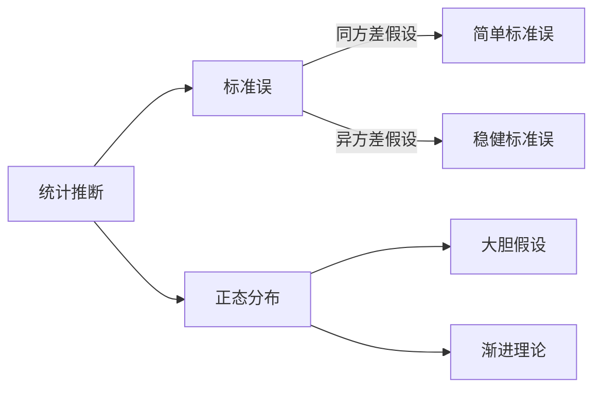

---
{"dg-publish":true,"permalink":"/🔍计量经济学/Best Linear Unbiased Estimator/","created":"2025-08-20T11:56:52.000+08:00","updated":"2025-08-20T11:56:52.000+08:00"}
---

[[🔍计量经济学/Linear Regression Model#模型设定\|Linear Regression Model#模型设定]]如下
$$
\begin{gather*}
\begin{cases}
Y=X^{\mathsf{T}}{\beta}+e\\
E(e|X)=0
\end{cases} \tag{1} \\
\begin{cases}
E(Y^2)<\infty \\
E(\Vert X \Vert^2)<\infty \\
E(XX^{\mathsf{T}})\succ O
\end{cases} \tag{2}
\end{gather*}
$$
[[🔍计量经济学/Least Squares Estimator#矩阵形式的情形\|Least Squares Estimator#矩阵形式的情形]] 为
$$
\hat{{\beta}}\equiv\left(\mathbf{X}^{\mathsf{T}}\mathbf{X} \right)^{-1}\left(\mathbf{X}^{\mathsf{T}}\mathbf{Y} \right)
$$

## Expectation of LS Estimator

若样本是独立同分布的，则有
$$
E[Y_i\mid X_1,\ldots,X_n]=E[Y_i\mid X_i]=X_i^{\mathsf{T}}{\beta}
$$
从而有（需要用到 $E[e\mid X]=0$）
$$
E[\mathbf{Y}\mid \mathbf{X}]=
\begin{bmatrix}
\vdots \\
E[Y_i\mid \mathbf{X}] \\
\vdots \\
\end{bmatrix}
=
\begin{bmatrix}
\vdots \\
X_i^{\mathsf{T}}{\beta} \\
\vdots \\
\end{bmatrix}
=\mathbf{X}{\beta}
$$
参数估计量的条件期望为
$$
\begin{align}
E[\hat{{\beta}}\mid \mathbf{X}]
&=E\left[(\mathbf{X}^{\mathsf{T}}\mathbf{X})^{-1}\mathbf{X}^{\mathsf{T}}\mathbf{Y}\mid \mathbf{X} \right] \\
&=(\mathbf{X}^{\mathsf{T}}\mathbf{X})^{-1}\mathbf{X}^{\mathsf{T}}E\left[\mathbf{Y}\mid \mathbf{X} \right] \\
&=(\mathbf{X}^{\mathsf{T}}\mathbf{X})^{-1}\mathbf{X}^{\mathsf{T}}\mathbf{X}{\beta} \\
&={\beta}
\end{align}
$$
If $(X,e)$ have a joint normal distribution[^1]，根据期望迭代法则有
$$
E({\beta})=E[E[\hat{{\beta}}\mid \mathbf{X}]\mid X]=E[{\beta}\mid \mathbf{X}]={\beta}
$$
[^1]: 这是一个充分不必要条件；如果 $X$ 服从离散型分布，$\hat{{\beta}}$ 的期望和方差可能不存在。

## Variance of LS Estimator

参数估计量的条件方差为
$$
\begin{align}
Var[\hat{{\beta}}\mid \mathbf{X}]
&=Var[(\mathbf{X}^{\mathsf{T}}\mathbf{X})^{-1}\mathbf{X}^{\mathsf{T}}\mathbf{Y}|\mathbf{X}] \\
&=(\mathbf{X}^{\mathsf{T}}\mathbf{X})^{-1}\mathbf{X}^{\mathsf{T}}Var[\mathbf{Y}\mid \mathbf{X}]\mathbf{X}(\mathbf{X}^{\mathsf{T}}\mathbf{X})^{-1} \\
&=(\mathbf{X}^{\mathsf{T}}\mathbf{X})^{-1}\mathbf{X}^{\mathsf{T}}Var[\mathbf{X}{\beta}+\mathbf{e}\mid \mathbf{X}]\mathbf{X}(\mathbf{X}^{\mathsf{T}}\mathbf{X})^{-1} \\
&=(\mathbf{X}^{\mathsf{T}}\mathbf{X})^{-1}\mathbf{X}^{\mathsf{T}}Var[\mathbf{e}|\mathbf{X}]\mathbf{X}(\mathbf{X}^{\mathsf{T}}\mathbf{X})^{-1} \\
&=(\mathbf{X}^{\mathsf{T}}\mathbf{X})^{-1}\mathbf{X}^{\mathsf{T}}\boldsymbol{\Omega}\mathbf{X}(\mathbf{X}^{\mathsf{T}}\mathbf{X})^{-1}
\end{align}
$$
特别地，若误差项满足同方差（homoskedastic）假设，即
$$
\boldsymbol{\Omega}=Var[\mathbf{e}|\mathbf{X}]=\sigma^{2} \mathbf{I}_{n}
$$
则参数估计量的条件方差为
$$
Var[\hat{{\beta}}\mid \mathbf{X}]=(\mathbf{X}^{\mathsf{T}}\mathbf{X})^{-1}\sigma^{2}
$$
**Gauss-Markov Theorem** Take the homoskedastic linear regression model. If $\tilde{{\beta}}$ is an linear unbiased estimator of ${\beta}$ then
$$
Var[\tilde{{\beta}}\mid \mathbf{X}]\ge (\mathbf{X}^{\mathsf{T}}\mathbf{X})^{-1}\sigma^{2}
$$
即 Least Squares Estimator 是所有线性无偏估计量中条件方差最小的。

然而，同方差假设在实践中几乎不可能满足；即使满足， $\sigma^{2}$ 也是未知参数，无法用于计算参数估计量的标准误（$SE[\hat{\beta}\mid \mathbf{X}]$）用于统计推断。因此，有必要构建 $\sigma^{2}$ 的估计量和非同方差假设下参数估计量的条件方差。

👉 [[🔍计量经济学/Homoskedasticity and Heteroskedasticity\|Homoskedasticity and Heteroskedasticity]]

## 基本假设与模型性质

| 序号 | 假设                 | 表达式         |
| ---- | -------------------- | -------------- |
| ①    | 线性模型             | $Y=X\beta+e$   |
| ②    | 零条件均值           | $E[e\mid X]=0$ | 
| ③    | 随机抽样             |                |
| ④    | 解释变量不完全共线   |                |
| ⑤    | 误差项满足同方差假设 | $Var[\mathbf{e}\mid\mathbf{X}]=\sigma^{2} \mathbf{I}_{n}$|
| ⑥    | 误差项服从正态分布   | $\mathbf{e}\mid\mathbf{X}\sim \mathcal{N}(0,\sigma^{2} \mathbf{I}_{n})$ |

> [!tip]
> ①-⑤称为 Gauss–Markov assumptions
> ①-⑥称为 classical linear model assumptions
> 
> ①②构成了 [[🔍计量经济学/Linear CEF Model\|Linear CEF Model]] ，③保证了样本独立同分布，④保证了参数估计量有数值解，①-④即可得出无偏性。⑤可得出参数估计量的理想条件方差但并不现实，因此有必要使用各种稳健标准误。⑥用于统计推断但直接假设缺乏说服力，最好借助中心极限定理和渐进理论。
> 

> [!quote]
> The CLM assumptions are very strong, and a primary focus in theoretical and applied econometrics has been to conduct inference using OLS in a variety of settings – cross-sectional data, time series data, panel data, and data with a spatial structure – while imposing few assumptions. It is very difficult to get anywhere without relying on asymptotics. Therefore, we replace the CLM assumptions and rely on application of the law of large numbers and central limit theorem.(Wooldridge,2023)

## 渐进性质

