---
{"dg-publish":true,"permalink":"/🔍计量经济学/Omitted Variable Bias/","created":"2024-10-12T10:24:49.000+08:00","updated":"2024-10-12T10:24:49.000+08:00"}
---

## 多元情形

假设实际结构方程为
$$
Y=X^{\mathsf{T}}{\beta}+\gamma Z+u
$$
估计的结构方程为
$$
Y=X^{\mathsf{T}}{\beta'}+v
$$
这意味着
$$
\begin{align}
E[Xv]&=E[X(\gamma Z+u)] \\
&=\gamma E[XZ]+E[Xu] \\
&=\gamma E[XZ]\neq 0
\end{align}
$$
因此存在内生性问题。此时
$$
\begin{align}
{\beta}' & =E[XX^{\mathsf{T}}]^{-1}E[XY] \\
&=E[XX^{\mathsf{T}}]^{-1}E[X(X^{\mathsf{T}}\beta+\gamma Z+u)] \\
&={\beta}+\gamma E[XX^{\mathsf{T}}]^{-1}E[XZ]+0 \\
&={\beta}+\gamma\delta
\end{align}
$$
其中 $\delta$ 是 $Z$ 对 $X$ 回归的系数。

可见遗漏变量偏差的符号和大小由 $\gamma$ 和 $\delta$ 共同决定。例如，$Z$ 对 $X$ 和 $Y$ 的影响都很小则遗漏变量偏差并不严重，不过这一点不容易检验。

## 一元情形

假设实际的结构方程为
$$
Y=\alpha+\beta X+\gamma Z+u
$$
估计的结构方程为
$$
Y=\alpha'+\beta'X+v
$$
此时
$$
\begin{align}
\beta'=\frac{Cov(X,Y)}{Var(X)}&=\frac{Cov(X,\alpha+\beta X+\gamma Z+u)}{Var(X)} \\
&=\frac{\beta Var(X)+\gamma Cov(X,Z)}{Var(X)} \\
&=\beta +\gamma \delta \\
\end{align}
$$
其中 $\delta$ 是 $X$ 对 $Z$ 回归的系数。

```mermaid
flowchart LR
X --> | 〈β〉 |Y
Z --> | 〈δ〉 |X
Z --> | 〈γ〉 |Y
```

或者
$$
\begin{align}
\beta'&=\frac{Cov(X,\alpha'+\beta'X+v)}{Var(X)} \\
&=\beta +\frac{Cov(X,v)}{Var(X)} \\
&=\beta +\frac{Cov(X,v)}{\sqrt{ Var(X)Var(v) }}\sqrt{ \frac{Var(v)}{Var(X)} } \\
&=\beta +\rho(X,v) \frac{\sigma_{v}}{\sigma_{X}}
\end{align}
$$
可见遗漏变量偏差的符号和大小由 $\rho(X,v)=\gamma\rho(X,Z)$ 以及相对标准差共同决定。例如，$X$ 的方差很大但 $v$ 的方差很小，则遗漏变量偏差并不严重，这一点很容易检验。
